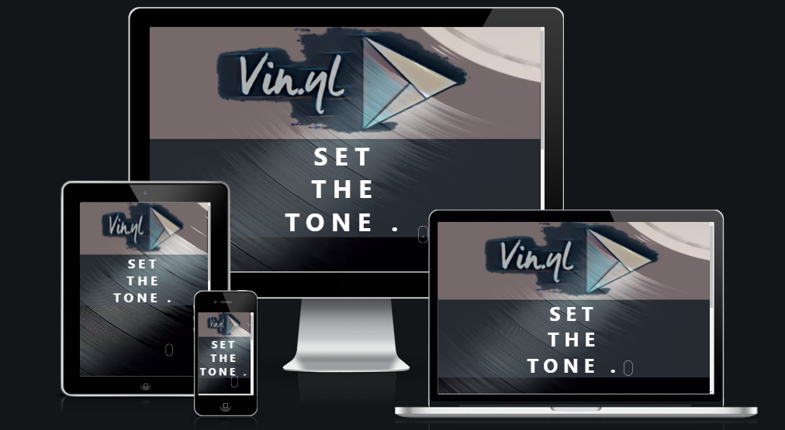

# Vin.yl music player
Interactive Frontend Development for Project Portfolio 2 at Code Institute

This project is an audio player, built as a React application. 
It allows the user to stream music, which provides an uninterrupted listening experience, without saving the audio on the user's device.
The player has audio controls like play, pause, volume and even rewind, forward buttons.
The application consists of 2 sections - heading and music player.  
Once the user scrolls down for the music player; a popup will trigger to prompt user to enter a 4-digit pin code.

[Live Project Here](https://cgauci87.github.io/rediffusion/)

 

## UX
The application is designed for music lovers.
It is designed to be user friendly, simple and clean while making sure it is responsive and visually appealing on all devices.
It is made for anyone who loves music and wants a quick and easy way to play the music online. 
Users will get a hasslefree experience using this music player. 
The project is a simple and straightforward single-page-application with two sections - heading and the music player application itself.

### User Stories

#### Story 1
As a Developer, I want to:

Build an app that is visually appealing to encourage the user to use it frequently.

#### Story 2
As a user, I want to:

Be able to easily navigate throughout the application and use simplified controls.

### Strategy
The goal with the application is to provide quick and easy access to the functions, and controls it provides.
The design should fit the purpose.
The foundation of the application should be solid with room for improvement for future updates/releases.

### Scope
The users should be able to use a fully functioning application for streaming music.

### Structure
The application has a simple structure with the intro giving a message as a heading once the user lands to the site.
The next section upon scrolling, is the music player application.

## Features
The application contains following features with the remaining to be implemented in the future.

### Existing Features

#### Interactive background
A function that checks current state of the player and uses it to change the state of background. The design is made to provide the user with an immersive experience.

#### Playback & Visualization
The Web Audio API provided methods to control the playback as well as visualize the music.
Find out more about Web Audio API [here](https://developer.mozilla.org/en-US/docs/Web/API/Web_Audio_API).

#### Music player 
The next/previous functionality was built using UseState and UseEffect hooks. 
Find out more about hooks [here](https://reactjs.org/docs/hooks-reference.html "Hooks API Reference").

##### CSS Animations
Creation of scroll-indicator and hover effects.
Find out more about animations [here](https://www.w3schools.com/css/css3_animations.asp).

### Features Left to Implement

#### More options to the music player
Add an option for the user to upload their own music track or an entire playlist.

#### Recourses
Provide more resources, in this case music. Add new playlists, and albums.

#### Smooth Interactive design
Add transitional times for background to make the experience slicker.

## Technologies Used

### HTML
This project uses semantic [HTML](https://html.com/ "HTML") to improve SEO and user friendliness. 
The HTML is written in jsx-syntax in this React app. 

### CSS
The project uses responsive design to improve the user experience and availability on all devices. 
The [CSS](https://www.w3.org/Style/CSS/Overview.en.html "CSS") is separated using comments. 

### JS
I used [JavaScript](https://www.javascript.com/ "JavaScript") for all the functions and interactivity on the application. 
Comments are provided to give an explanation of the functions. 

### React
I used [React](https://reactjs.org/ "React") as a framework for all the functions and states. 
React is a JavaScript library that builds user interfaces for single-page applications by dividing UI into composable components.
Businesses that use ReactJS are assured of better performance compared to those that use other frameworks. 
Because ReactJS helps to prevent updating of DOM, it means that the apps will be faster and deliver better UX. 
ReactJS was designed to help improve the total rendered pages from the website server.

## Testing
I have tested the application and sought for flaws in the design and errors in the functionality on several browsers on desktop, laptop and Samsung Galaxy S9 Plus.
The expected outcome is that the application is responsive and functional on all browsers/devices. 
Functions like audio controls should work properly.

### Different Browsers and devices

#### Desktop

| Description   | Expected outcome | Pass | Comments |
| ------------- |:----------------:| ----:| --------:|
| Internet Explorer | The application works appropriately | No |  |
| Google Chrome | The application works appropriately | Yes | - |
| Mozilla Firefox | The application works appropriately | Yes | - |
| Safari | The application works appropriately | Yes | - |

#### Mobile

| Description   | Expected outcome | Pass | Comments |
| ------------- |:----------------:| ----:| --------:|
| Google Chrome | The application works appropriately | Yes | - |
| Safari | The application works appropriately | Yes | - |

### Responsiveness

I have tested the responsiveness of the application [here](http://ami.responsivedesign.is/# "Am I Responsive?") and it is responsive.

### Code validation

#### CSS
I validated my CSS with the [Jigsaw W3C Validation Service](https://jigsaw.w3.org/css-validator/ "CSS Validation"). 
No major errors.

#### HTML
I validated my HTML with the [W3C Markup Validation Service](https://validator.w3.org/ "HTML Validator") with no errors or warnings to show.

#### JS
I ran my JavaScript through jshint, [JSHint](https://jshint.com/ "JSHint"), with no major issues. 

### Conclusion
Post deployment testing has beeen conducted, application is functioning as intended. 
Future implementation of new features are in the pipepline which should maximise the applications's potential.
The minor flaws which may occur, does not ruin the user experience but should be corrected in the future.

## Deployment
I followed this [guide](https://github.com/gitname/react-gh-pages "Deploy React to GitHub Pages") to create and deploy the react app to GitHub Pages.
Initially I created the app using VS Code locally on my computer and later continued the development on GitPod, commits were done to git and pushed to the master branch on GitHub. 

To deploy this page to GitHub Pages from its [GitHub repository](https://github.com/cgauci87/rediffusion "GitHub repository"), the following steps were taken:

1. Log into GitHub

2. From the list of repositories on the screen, select **cgauci87/rediffusion**

3. Go to **Settings**

4. Scroll down to the **GitHub Pages** section.

5. Under **Source** click the drop-down menu labelled None and select **Branch: main**

6. On selecting **Branch: main** the page is automatically refreshed, click save, the application is now deployed.

7. Scroll back down to the **GitHub Pages** section to retrieve the link to the deployed application.

Now you can package and push the project to **Branch: main** to update the deployed version of the application with the command `$ npm run deploy`.
At the moment of submitting this Milestone project the Development Branch and Master Branch are identical.

### How to run this project locally

1. Use this [link](https://github.com/cgauci87/rediffusion/ "rediffusion") to get to the projects repository.

2. Click "Clone or Download".

3. Click the "copy" icon.

4. Open Git Bash in your local IDE.

5. Change your current working directory to where you want the cloned directory to be made.

6. Type `$ git clone` and then paste the URL you copied earlier.

   `git clone https://github.com/USERNAME/REPOSITORY`

7. When you press enter your local clone will be ready.

## Credits

### Content
All content on the application was written by myself. 

### Media
The logo and background used for this project was provided by [Pexels](https://www.pexels.com/ "Pexels").
All music was provided by [Synchedin](https://synchedin.com/ "Synchedin").

### Acknowledgements
I believe [React](https://reactjs.org/ "React") has proved to be a robust framework for creating this application and for long-term efficiency.
It works better and is simplified to work with than I could have thought.
I'm looking forward to keep improving my knowledge of JavaScript and React, to improve this application as well as applying it to future projects.

## Resources
Below is a list of the resources used to create this project:

- [Deploying a React App to GitHub Pages](https://github.com/gitname/react-gh-pages "Create React App and deploy to GitHub Pages")
- [React](https://reactjs.org/ "React")
- [React Tutorial](https://reactjs.org/tutorial/tutorial.html#before-we-start-the-tutorial "React Tutorial")
- [React Fundamentals](https://reactnative.dev/docs/intro-react "React Fundamentals")
- [React Custom Hooks](https://reactjs.org/docs/hooks-custom.html "React Custom Hooks")
- [Using the State Hook](https://reactjs.org/docs/hooks-state.html "Using the State Hook")
- [Hooks API Reference](https://reactjs.org/docs/hooks-reference.html "Hooks API Reference")
- [React Media Queries](https://github.com/ReactTraining/react-media "React Media Queries")

## Special Thanks
Special thanks to my mentor Brian O'Hare and my fellow students at Code Institute for their assistance throughout this project.

